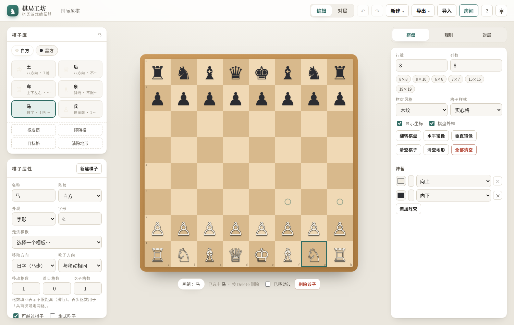
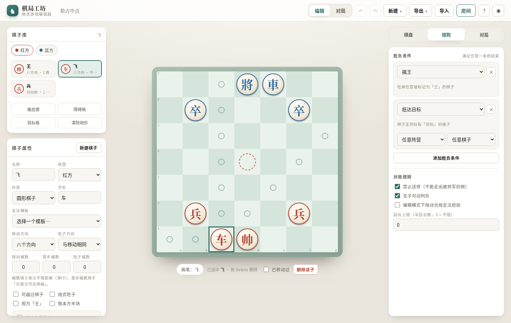
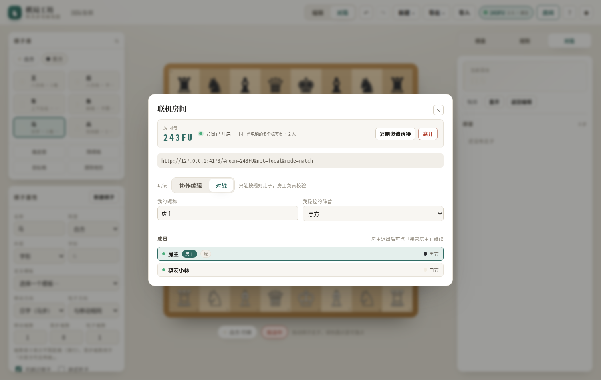

# 棋局工坊 · 棋类游戏编辑器

一个**零依赖、零构建**的网页版棋类游戏编辑器：像棋盘模拟器一样自由摆棋，同时可以设计棋盘、设计棋子的走法约束，并让程序自动判定胜负。

打开 `index.html` 即可使用（双击文件也行，不需要服务器、不需要安装任何东西）。
内置**联机房间**：多人一起摆棋、共同设计规则，或直接双人对战 —— 同样不需要自己部署服务器。


---

## 预览

**编辑模式**：自由摆棋、拖动换位；点选棋子就能预览它的走法范围（图为白马的 f3 / h3 两个落点），左侧实时编辑这枚棋子的走法规则。



**棋局设计**：自定义棋盘大小与风格、圆形棋子 / 字形棋子、障碍格与目标格，并用「胜负条件」组合出各种玩法（图为 7×7「抢占中点」：中方虚线圆是目标格，所选棋子的全部落点已高亮）。



**联机房间**：不需要自己部署服务器 —— 图中是两个真实浏览器实例通过房间号连在一起对战，双方各自认领一方（房主执黑、棋友小林执白）。



> 以上截图由无头 Chrome 打开真实页面自动生成（`docs/` 目录），不是效果图。

---

## 功能总览

### 1. 自由摆棋（编辑模式）
- 左侧棋子库选子 → 点棋盘**空地**落子；拖动棋子即可换位。
- 拖动有约束：**不能与其它棋子重叠、不能落在障碍格上、不能越出棋盘**。
- 右键删除棋子；也可用橡皮擦画笔按住拖动连续擦除。
- 点选棋子会预览它的走法范围（虚点），并在状态条里显示「已移动过」开关（影响「首步两格」这类规则）。
- 想要更严格的约束，可在「规则」里打开**编辑模式下拖动也按走法校验**（默认关闭 = 自由摆放）。
- 撤销 / 重做覆盖所有编辑动作，`Ctrl+Z` / `Ctrl+Shift+Z`。

### 2. 自由造棋盘
- 行数、列数 **2×2 ~ 24×24**，常用尺寸一键切换。
- 5 种风格：木纹、大理石、青玉、素纸、午夜；格子样式可选**实心格 / 线框格**（围棋盘那种）。
- 坐标显示、棋盘外框开关、翻转棋盘、水平 / 垂直镜像（方便做对称布局）。
- 地形画笔：**障碍格**（阻断走子路线、不可停留）、**目标格**（用于「抵达目标」胜负条件）。
- 阵营可增减（支持三方甚至多方棋），可改名称、颜色与朝向（决定「向前」是哪个方向）。

### 3. 设计棋子的行为约束
每个棋子类型都可以单独配置：

| 配置项 | 说明 |
| --- | --- |
| 走法模板 | 单步四方 / 八方向 / 车 / 象 / 后 / 马 / 蹩马腿的马 / 田字象 / 炮 / 兵卒 … 一键套用后再微调 |
| 移动方向 | 上下左右、斜向、八方、仅向前、仅前斜、仅向后、仅左右、日字（马步）、自定义向量 |
| 移动格数 | 填 `0` 表示不限距离（滑行）；另有「首步格数」用于兵卒首次可走两格 |
| 吃子方向 / 格数 | 可与移动方向不同（国际象棋兵：直行、斜吃），也可设为「不能吃子」 |
| 可越过棋子 | 勾选 = 马；不勾选则会被别住 —— **蹩马腿**、**塞象眼**都会自动生效 |
| 炮式吃子 | 直行不吃子，吃子必须隔一个「炮架」 |
| 限本方半场 | 做出不能过河的棋子 |
| 视为「王」 | 被吃掉即触发「擒王」胜负 |
| 抵达底线升变 | 走到底线自动变成指定棋子（默认关闭） |
| 外观 | 字形（♞ / 車 / 任意 1–2 字）、圆形棋子、围棋子；颜色跟随阵营 |

### 4. 胜负判定
可叠加多条，满足任意一条即结束：

- **擒王**：吃掉被标记为「王」的棋子。
- **全歼**：指定阵营的棋子被全部消灭。
- **抵达目标**：指定（或任意）棋子走到目标格。
- **无子可动判负**（困毙）与**回合上限判和**在「对局规则」中开关。
- 另有**禁止送将**：不能走出让自己被将军的棋（国际象棋 / 中国象棋式）。

### 5. 对局模式
- 严格按规则校验走法：非法走法会被拒绝并抖动提示，合法落点用圆点 / 圆环标出。
- 自动轮转回合、记录棋谱（`♞ g1→f3`、吃子标红），支持悔棋、重开、返回编辑。
- 将军提示、被将的王高亮闪烁、胜负横幅。
- 棋至终局会弹出结果与原因。

### 6. 其他
- 6 套现成模板：国际象棋 8×8、中国象棋 9×10、迷你象棋 6×6、空白棋局、抢占中点 7×7、围棋盘 19×19。
- 导出 **JSON**（含棋盘 + 棋子 + 规则，可再导入）、**SVG / PNG 棋盘图片**、复制 JSON 到剪贴板。
- 本地自动存档（刷新不丢失）、明暗主题切换、响应式布局（窄屏自动堆叠）。


---

## 联机房间：不需要自己部署服务器

右上角「房间」即可创建/加入房间。**三种联机方式都不需要自建后端、不需要注册账号：**

| 方式 | 原理 | 适用场景 | 代价 |
| --- | --- | --- | --- |
| **同一台电脑的多个标签页** | 浏览器 `BroadcastChannel`，同一标签页之间直接通信 | 一台电脑开两个窗口演示、双人同机对战 | 只在本机；`file://` 打开时部分浏览器会隔离，建议用 `npm start` 起的地址 |
| **公共中继（推荐）** | 借用公共 MQTT 服务器（EMQX / HiveMQ）转发消息 | 异地联机、多人协作 | 公共信道，知道房间号的人都能进出；服务器是免费的公共设施，稳定性不保证 |
| **WebRTC 点对点（实验性）** | PeerJS 公共信令服务器撮合后浏览器直连，房主中转 | 延迟最低的两人对局 | 需要联网加载组件；双方网络需允许直连（对称 NAT 下可能失败） |

> 想更稳、更私密时，随时可以换成自己的服务器：公共中继填自己的 `wss://…/mqtt` 即可（例如自建 EMQX/Mosquitto），前端代码一行都不用改。

### 房间怎么工作

- **房主权威**：房主持有权威棋局，加入者的改动发给房主，房主应用后再广播新状态。这样天然避免了冲突与作弊。
- **协作编辑模式**：所有人都能改棋盘、棋子属性与规则；每次改动同步整盘状态（简单、万无一失）。
- **对战模式**：每人认领一方（自动分配空闲阵营），只能按规则走自己的子；走子以指令形式发给房主，房主用规则引擎校验后才生效。
- **在线状态**：3 秒心跳 + 12 秒超时，成员列表实时更新；房主退出后其他人可以「接管房主」继续。
- **邀请链接**：`…/index.html#room=ABCDE&net=mqtt`，对方打开即自动加入（链接里带着联机方式与中继地址）。
- 对战模式下加入者的编辑入口会被锁定，只保留走子与查看。

### 端到端验证

联机部分有四层自动化测试，包括**用真实公共代理跑通两个浏览器之间的完整链路**：

```bash
npm test        # 规则引擎 46 项 + 房间协议 28 项（内存总线模拟 3 个客户端）
npm run test:dom  # jsdom 集成 69 项 + 两个浏览器端到端 31 项（含对战校验、悔棋、接管）
npm run test:net  # 真实公共 MQTT 代理链路 8 项（需要外网；连不上会自动跳过）
```

---

## 快捷键

| 按键 | 作用 |
| --- | --- |
| `1` – `9` | 切换当前阵营棋子库里的第 N 个棋子 |
| `E` | 切到橡皮擦 |
| `Delete` / `Backspace` | 删除选中的棋子（编辑模式） |
| `Ctrl+Z` / `Ctrl+Shift+Z`（或 `Ctrl+Y`） | 撤销 / 重做 |
| `Ctrl+S` | 导出棋局文件 |
| `Esc` | 取消选中 / 关闭弹层 |

---

## 目录结构

```
index.html          页面骨架
styles.css          全部样式（主题变量集中在文件顶部）
src/presets.js      棋盘风格、方向组、走法模板、棋局模板
src/model.js        数据模型：状态结构、查询辅助、导入数据的修复
src/rules.js        规则引擎：走法生成、合法性、将军、胜负（不碰 DOM，可独立测试）
src/render.js       棋盘渲染、棋子动画、拖拽与涂抹手势
src/panels.js       侧栏界面：棋子库、棋子属性、棋盘设置、规则、对局面板
src/app.js          控制器：状态与撤销栈、模式切换、存档与导入导出
src/mqtt.js         极简 MQTT 3.1.1 over WebSocket 客户端（零依赖，约 200 行）
src/net.js          传输层（本机标签页 / 公共中继 / WebRTC）+ 房间协议（房主权威）
src/room.js         房间面板：成员、阵营认领、模式切换、邀请链接
tests/engine.test.mjs  规则引擎测试（纯 Node，无需任何依赖）
tests/room.test.mjs    房间协议测试（内存总线，3 个模拟客户端）
tests/dom.test.mjs     界面集成测试（jsdom，可选）
tests/roomui.test.mjs  两个浏览器端到端联机测试（jsdom，可选）
tests/netmqtt.test.mjs 真实公共代理链路测试（需要外网）
```

规则引擎与界面完全解耦：`src/rules.js` 里的 `generateMoves / legalMovesFor / isInCheck / evaluate` 只依赖纯数据，因此可以脱离浏览器直接测试与复用。

## 测试

```bash
node tests/engine.test.mjs      # 46 项：走法、马腿、炮架、障碍、将军、胜负判定
node tests/room.test.mjs        # 28 项：加入/同步/对战校验/在线状态/房主接管
```

集成测试需要 jsdom（仅测试用，应用本身零依赖）：

```bash
npm i -D jsdom
node tests/dom.test.mjs         # 69 项：拖拽落子、画笔、规则约束、撤销重做、模板、导出
```

## 部署到 GitHub Pages

这是一个**纯静态、零构建**的站点（所有引用都是相对路径），因此可以直接用 GitHub Pages 托管：
线上地址 <https://xuyinjiesh.github.io/chess-editor/>。

- 发布源：`main` 分支根目录（Deploy from a branch），不需要任何构建步骤，也不需要 GitHub Actions。
- 根目录的 `.nojekyll` 用来关掉 Jekyll 处理，保证 `src/`、`docs/` 等目录原样发布。
- 免费账号的 Pages **只支持公开仓库**，所以本仓库需要是 public。
- 房间功能在 Pages 上体验最好：`BroadcastChannel` 与 `navigator.clipboard` 都需要非 `file://` 的安全上下文，HTTPS 页面下全部可用。

对应的命令行操作（已在本机执行过）：

```bash
gh repo edit xuyinjiesh/chess-editor --visibility public --accept-visibility-change-consequences
echo '{"source":{"branch":"main","path":"/"},"build_type":"legacy"}' \
  | gh api -X POST repos/xuyinjiesh/chess-editor/pages --input -
gh api repos/xuyinjiesh/chess-editor/pages --jq '{status,html_url}'
```

## 已知取舍

- 中国象棋模板的走法（车马炮象士卒）已按真实规则实现，但**九宫限制、过河后横走、将帅照面**尚未内置，可用「限本方半场」与自定义方向近似，或后续扩展区域限制。
- 国际象棋未实现**王车易位**与**吃过路兵**，其余（含兵首步两格、斜吃、升变、禁自将）均已实现。
- 围棋盘仅用于摆谱 / 打谱，不含提子与数目。
